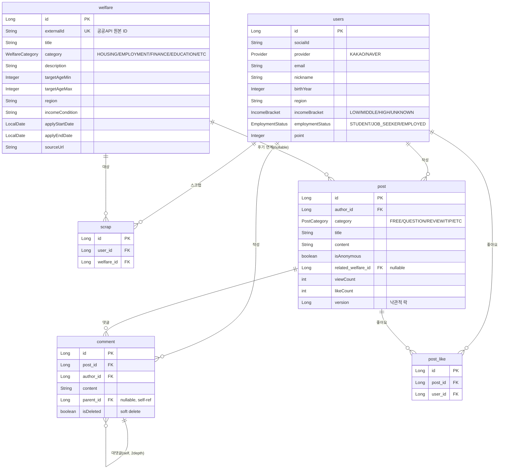
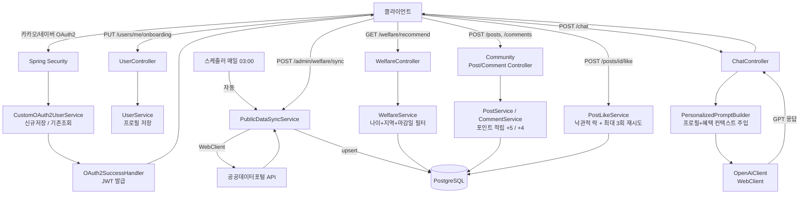

# Youfare 🌱

> **Youth + Welfare** — 청년 금융·복지 통합 큐레이션 백엔드

청년층이 복지·금융 혜택 정보에 쉽게 접근하지 못하는 **정보 비대칭 문제를 해결**하기 위해,
공공데이터 기반 맞춤형 복지 추천과 AI 챗봇 상담 기능을 제공하는 RESTful API 서버입니다.

---

## 📌 기획 배경

청년층은 주거·취업·금융 지원 혜택이 방대하게 존재함에도, 정보가 여러 기관에 분산되어 찾기 어렵습니다.
Youfare는 공공데이터포털 API를 통해 혜택을 자동 수집·정규화하고, 개인 프로필 기반으로 필터링하여
**"지금 나에게 맞는 혜택"** 을 즉시 확인하고 AI 상담까지 받을 수 있는 플랫폼입니다.

---

## 🛠 기술 스택

| 분류 | 기술 |
|---|---|
| Language | Java 17 |
| Framework | Spring Boot 3.3 |
| Build | Gradle (Groovy) |
| DB | PostgreSQL 16 + JPA/Hibernate |
| 인증 | Spring Security + OAuth2(카카오/네이버) + JWT |
| HTTP Client | Spring WebFlux WebClient |
| 외부 연동 | 공공데이터포털 API, OpenAI Chat Completions API |
| API 문서 | springdoc-openapi (Swagger UI) |
| 컨테이너 | Docker / Docker Compose |

---

## ✨ 주요 기능

| 기능 | 설명 |
|---|---|
| 소셜 로그인 | 카카오/네이버 OAuth2 → JWT 발급 |
| 온보딩 | 생년·지역·소득구간·취업상태 입력 |
| 복지 목록 조회 | 카테고리/지역 필터 + 페이징, 마감 임박 D-Day 표시 |
| 개인화 추천 | 유저 프로필 기반 신청 가능한 혜택만 필터링 |
| AI 챗봇 | 개인 프로필 + 맞춤 혜택 목록을 컨텍스트로 주입한 GPT 상담 |
| 스크랩 | 혜택 저장/해제, 중복 방지 |
| 포인트/등급 | 활동(스크랩·챗봇·게시글·댓글) 시 포인트 적립, 5단계 등급 |
| 공공데이터 동기화 | 하루 1회 자동 + 수동 트리거 API |
| 커뮤니티 게시판 | 게시글 CRUD, 카테고리 필터, 최신순/좋아요순 정렬, 익명 작성 |
| 댓글/대댓글 | 2depth 고정 대댓글, soft delete(구조 보존), 중첩 조회 |
| 좋아요 | 토글 방식, 낙관적 락(@Version) + 재시도로 동시성 처리 |
| 인기글 | 최근 7일 내 (likeCount×2 + viewCount) 상위 10개 |
| 혜택 후기 연계 | 복지 혜택별 REVIEW 게시글 조회 (혜택 상세 페이지 연동) |

---

## 🗄 ERD



> **제약 조건** — `scrap(user_id, welfare_id)`, `post_like(post_id, user_id)` 는 각각 복합 UNIQUE 제약으로 중복을 막는다.

---

## 🏗 아키텍처 흐름



전체 사용자 여정은 **소셜 로그인 → 온보딩 → (백그라운드) 공공API 동기화 → 개인화 추천 → AI 챗봇 상담 → 커뮤니티(후기·좋아요)** 순으로 이어진다.

---

## 🚀 실행 방법

### 1. PostgreSQL 실행
```bash
docker-compose up -d
```

### 2. 환경변수 설정
```bash
export DB_HOST=localhost
export DB_PORT=5432
export DB_NAME=youfare
export DB_USERNAME=youfare
export DB_PASSWORD=youfare

export JWT_SECRET=your-secret-key-at-least-32-characters
export KAKAO_CLIENT_ID=your-kakao-client-id
export KAKAO_CLIENT_SECRET=your-kakao-client-secret
export NAVER_CLIENT_ID=your-naver-client-id
export NAVER_CLIENT_SECRET=your-naver-client-secret
export PUBLIC_DATA_API_KEY=your-public-data-api-key
export OPENAI_API_KEY=your-openai-api-key
```

### 3. 빌드 & 실행
```bash
./gradlew build
./gradlew bootRun
```

Swagger UI: http://localhost:8080/swagger-ui.html

---

## 🔑 환경변수 목록

| 변수명 | 설명 | 기본값 |
|---|---|---|
| DB_HOST | PostgreSQL 호스트 | localhost |
| DB_PORT | PostgreSQL 포트 | 5432 |
| DB_NAME | DB 이름 | youfare |
| DB_USERNAME | DB 유저 | youfare |
| DB_PASSWORD | DB 비밀번호 | youfare |
| JWT_SECRET | JWT 서명 키 (32자 이상) | (개발용 기본값 내장) |
| JWT_EXPIRATION_MS | 토큰 만료 시간(ms) | 86400000 (24h) |
| KAKAO_CLIENT_ID | 카카오 REST API 키 | (더미값, 로그인 사용 시 실제 키 필수) |
| KAKAO_CLIENT_SECRET | 카카오 앱 시크릿 | (더미값, 로그인 사용 시 실제 키 필수) |
| NAVER_CLIENT_ID | 네이버 앱 ID | (개발용 기본값 내장) |
| NAVER_CLIENT_SECRET | 네이버 앱 시크릿 | (개발용 기본값 내장) |
| PUBLIC_DATA_API_KEY | 공공데이터포털 인증키 | (개발용 기본값 내장) |
| PUBLIC_DATA_BASE_URL | 공공API 엔드포인트 | 복지로 API |
| OPENAI_API_KEY | OpenAI API 키 | (개발용 기본값 내장) |
| OPENAI_MODEL | 사용할 GPT 모델 | gpt-4o-mini |

> 기본값이 내장된 항목은 환경변수 없이도 로컬 실행이 가능합니다.  
> 프로덕션 배포 시에는 반드시 실제 키로 교체해야 합니다.

---

## 📡 API 요약

| Method | Path | 설명 | 인증 |
|---|---|---|---|
| GET | /oauth2/authorization/kakao | 카카오 로그인 | ✗ |
| GET | /oauth2/authorization/naver | 네이버 로그인 | ✗ |
| GET | /users/me | 내 프로필 조회 | ✓ |
| PUT | /users/me/onboarding | 온보딩 정보 저장 | ✓ |
| GET | /welfare | 복지 목록 (카테고리/지역 필터) | ✓ |
| GET | /welfare/recommend | 개인화 추천 목록 | ✓ |
| GET | /welfare/{id} | 복지 상세 조회 | ✓ |
| POST | /chat | AI 복지 챗봇 상담 | ✓ |
| POST | /scraps/{welfareId} | 스크랩 추가 | ✓ |
| DELETE | /scraps/{welfareId} | 스크랩 해제 | ✓ |
| GET | /scraps/me | 내 스크랩 목록 | ✓ |
| POST | /admin/welfare/sync | 공공데이터 수동 동기화 | ✓ |
| POST | /posts | 게시글 작성 (포인트 +5) | ✓ |
| GET | /posts | 게시글 목록 (category 필터, sort=latest\|likes) | ✓ |
| GET | /posts/hot | 인기글 상위 10개 (최근 7일) | ✓ |
| GET | /posts/{id} | 게시글 상세 (viewCount +1) | ✓ |
| PUT | /posts/{id} | 게시글 수정 (본인) | ✓ |
| DELETE | /posts/{id} | 게시글 삭제 (본인, hard delete) | ✓ |
| POST | /posts/{id}/like | 좋아요 토글 (낙관적 락) | ✓ |
| POST | /posts/{postId}/comments | 댓글/대댓글 작성 (포인트 +4) | ✓ |
| GET | /posts/{postId}/comments | 댓글 목록 (대댓글 중첩) | ✓ |
| DELETE | /posts/{postId}/comments/{commentId} | 댓글 삭제 (본인, soft delete) | ✓ |
| GET | /welfare/{welfareId}/posts | 혜택 후기(REVIEW) 목록 | ✓ |
| GET | /users/me/posts | 내 게시글 목록 | ✓ |
| GET | /users/me/comments | 내 댓글 목록 | ✓ |

---

## 🧠 기술적으로 고민한 점

### ① 개인화 컨텍스트 주입 설계 (RAG 패턴)

단순히 OpenAI에 질문을 전달하면 모든 유저가 동일한 답변을 받는다.
이를 해결하기 위해 **PersonalizedPromptBuilder**를 별도 클래스로 분리하고,
두 가지 정보를 시스템 프롬프트에 동적으로 주입했다.

1. **유저 프로필**: 나이, 지역, 소득구간, 취업상태
2. **맞춤 혜택 요약**: DB에서 해당 유저 조건에 맞는 상위 5건을 실시간 조회 → 텍스트 요약

이는 LLM에 외부 지식을 주입하는 **RAG(Retrieval-Augmented Generation)** 패턴과 유사하며,
"같은 질문, 다른 유저 → 다른 답변"을 보장한다.

---

### ② 좋아요 동시성 처리 (낙관적 락 선택 + 재시도)

여러 유저가 같은 게시글에 동시에 좋아요를 누르면 `Post.likeCount`가
"읽기 → +1 → 쓰기"로 갱신되는 사이 **Lost Update**가 발생한다.
(둘 다 10을 읽고 각자 11로 저장 → 실제론 12여야 하는데 11이 됨)

**낙관적 락(@Version)** 을 선택했다.

| 방식 | 장점 | 단점 |
|---|---|---|
| **낙관적 락(@Version)** ✅ | 평소 락 없이 빠름, 처리량(throughput) 우수 | 충돌 시 예외 → 재시도 로직 필요 |
| 비관적 락(SELECT FOR UPDATE) | 순차 처리 보장 | DB 락 점유 시간이 길어 처리량 저하 |

> **선택 이유**: 좋아요는 "같은 글·같은 순간"에 몰리는 경우가 드물어 **충돌 빈도가 낮고 재시도 비용이 적다**.
> 반면 비관적 락은 모든 요청을 줄 세워 락 대기를 유발하므로 처리량이 떨어진다.
> → 평소엔 락 없이 빠르게 처리하고, **드물게 충돌이 날 때만** 재시도하는 낙관적 락이 적합하다.

**재시도 전략** — `ObjectOptimisticLockingFailureException`을 잡아 **최대 3회** 재시도한다.
핵심은 재시도가 트랜잭션 **밖**에서 일어나야 한다는 점이다.
`@Transactional`은 프록시 기반이라 같은 빈 내부 호출(self-invocation)에는 새 트랜잭션이 열리지 않으므로,
실제 DB 작업을 별도 빈(`PostLikeProcessor`)으로 분리해 매 재시도마다 새 트랜잭션에서
**Post의 최신 @Version을 다시 읽도록** 했다. 또한 `(post_id, user_id)` **unique 제약**이
동시 더블클릭 같은 중복 좋아요의 최종 방어선 역할을 한다.

> 참고: **포인트 적립**은 반대로 **비관적 락**(`UserRepository.findByIdWithLock`, `SELECT FOR UPDATE`)을 쓴다.
> 쓰기 빈도가 낮아 락 대기 비용이 작고, "조회→계산→저장"을 순차 처리해 구현이 단순해지기 때문이다.
> → **충돌 빈도와 트랜잭션 특성에 따라 락 전략을 다르게 선택**한 것이 핵심이다.

---

### ③ 외부 API upsert 전략 (externalId 기준 중복 방지)

공공데이터 API는 동일 혜택이 반복 등장하므로 단순 insert 시 중복 데이터가 쌓인다.
`externalId`(공공API 원본 서비스 ID)를 **unique 키**로 지정하고,
`findByExternalId()`로 존재 여부를 확인 후 **있으면 update, 없으면 insert**하는
upsert 전략을 적용했다.

단건 실패가 전체 동기화를 중단하지 않도록 단건을 `REQUIRES_NEW` 독립 트랜잭션으로 격리하여
부분 성공 방식으로 안정성을 확보했다.

---

### ④ 대댓글 2depth 고정 (설계 의사결정)

댓글은 `parent` 필드로 자기 자신을 참조(self-referencing)하되, **2depth로 고정**했다.
(댓글 → 대댓글까지만, 대댓글의 대댓글은 불가)

- **왜 무한 depth가 아닌가**: depth 제한이 없으면 조회 시 재귀 쿼리 또는 N+1이 발생하고,
  UI에서도 들여쓰기가 끝없이 깊어져 가독성이 무너진다.
  대부분의 커뮤니티(인스타·유튜브 등)도 사실상 2depth만 사용한다.
- **검증 위치**: "부모가 이미 대댓글이면 그 아래 답글 불가"를 **Service 레이어**에서 검증하고
  (`COMMENT_DEPTH_EXCEEDED`, 400) 명확한 메시지를 반환한다. DB 제약 대신 도메인 규칙으로 표현.
- **조회 최적화**: 전체 댓글을 `JOIN FETCH`로 한 번에 가져온 뒤 `parentId` 기준으로
  **메모리에서 트리를 조립**한다(재귀 쿼리 불필요).
- **삭제 정책**: 대댓글이 달린 댓글을 hard delete하면 트리가 깨지므로,
  댓글 삭제는 **soft delete**(`isDeleted=true`)로 처리해 구조를 보존하고
  내용만 "삭제된 댓글입니다"로 대체한다.

---

### ⑤ 그 외 성능 최적화

| 항목 | 문제 | 해결 |
|---|---|---|
| **N+1 쿼리** | 스크랩·게시글·댓글 목록 조회 시 연관 엔티티(LAZY)를 개별 조회 | `JOIN FETCH`로 단일 쿼리 조회 |
| **WebClient 재생성** | 외부 API 호출마다 `builder.build()`로 커넥션 풀 재생성 | baseUrl·인증 헤더를 설정한 싱글톤 빈을 주입받아 재사용 |
| **동기화 트랜잭션 범위** | 전체 페이지를 하나의 트랜잭션으로 묶어 외부 호출 동안 커넥션 장기 점유 + 단건 오류 시 전체 롤백 | 단건 `REQUIRES_NEW` 독립 트랜잭션으로 분리해 커넥션 점유 최소화 및 실패 격리 |
