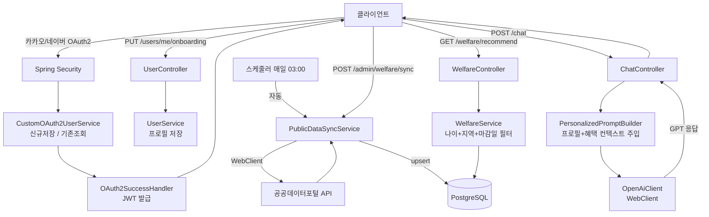

# Youfare 🌱

> **Youth + Welfare** — 청년 금융·복지 통합 큐레이션 백엔드

청년층이 복지·금융 혜택 정보에 쉽게 접근하지 못하는 **정보 비대칭 문제를 해결**하기 위해,
공공데이터 기반 맞춤형 복지 추천과 AI 챗봇 상담 기능을 제공하는 RESTful API 서버입니다.

---

## 📌 기획 배경

청년층은 주거·취업·금융 지원 혜택이 방대하게 존재함에도, 정보가 여러 기관에 분산되어 찾기 어렵습니다.
Youfare는 공공데이터포털 API를 통해 혜택을 자동 수집·정규화하고, 개인 프로필 기반으로 필터링하여
**"지금 나에게 맞는 혜택"** 을 즉시 확인하고 AI 상담까지 받을 수 있는 플랫폼입니다.

---

## 🛠 기술 스택

| 분류 | 기술 |
|---|---|
| Language | Java 17 |
| Framework | Spring Boot 3.3 |
| Build | Gradle (Groovy) |
| DB | PostgreSQL 16 + JPA/Hibernate |
| 인증 | Spring Security + OAuth2(카카오/네이버) + JWT |
| HTTP Client | Spring WebFlux WebClient |
| 외부 연동 | 공공데이터포털 API, OpenAI Chat Completions API |
| API 문서 | springdoc-openapi (Swagger UI) |
| 컨테이너 | Docker / Docker Compose |

---

## ✨ 주요 기능

| 기능 | 설명 |
|---|---|
| 소셜 로그인 | 카카오/네이버 OAuth2 → JWT 발급 |
| 온보딩 | 생년·지역·소득구간·취업상태 입력 |
| 복지 목록 조회 | 카테고리/지역 필터 + 페이징, 마감 임박 D-Day 표시 |
| 개인화 추천 | 유저 프로필 기반 신청 가능한 혜택만 필터링 |
| AI 챗봇 | 개인 프로필 + 맞춤 혜택 목록을 컨텍스트로 주입한 GPT 상담 |
| 스크랩 | 혜택 저장/해제, 중복 방지 |
| 포인트/등급 | 활동(스크랩·챗봇) 시 포인트 적립, 5단계 등급 |
| 공공데이터 동기화 | 하루 1회 자동 + 수동 트리거 API |

---

## 🗄 ERD

```
users
├── id (PK)
├── socialId, provider (KAKAO/NAVER)
├── email, nickname
├── birthYear, region
├── incomeBracket (LOW/MIDDLE/HIGH/UNKNOWN)
├── employmentStatus (STUDENT/JOB_SEEKER/EMPLOYED)
├── point
└── createdAt, updatedAt

welfare
├── id (PK)
├── externalId (UNIQUE) ← 공공API 원본 ID
├── title, category (HOUSING/EMPLOYMENT/FINANCE/EDUCATION/ETC)
├── description (TEXT)
├── targetAgeMin, targetAgeMax
├── region, incomeCondition
├── applyStartDate, applyEndDate
├── sourceUrl
└── createdAt, updatedAt

scrap
├── id (PK)
├── user_id (FK → users)  ┐ UNIQUE 제약
├── welfare_id (FK → welfare) ┘
└── createdAt
```

---

## 🏗 아키텍처 흐름



---

## 🚀 실행 방법

### 1. PostgreSQL 실행
```bash
docker-compose up -d
```

### 2. 환경변수 설정
```bash
export DB_HOST=localhost
export DB_PORT=5432
export DB_NAME=youfare
export DB_USERNAME=youfare
export DB_PASSWORD=youfare

export JWT_SECRET=your-secret-key-at-least-32-characters
export KAKAO_CLIENT_ID=your-kakao-client-id
export KAKAO_CLIENT_SECRET=your-kakao-client-secret
export NAVER_CLIENT_ID=your-naver-client-id
export NAVER_CLIENT_SECRET=your-naver-client-secret
export PUBLIC_DATA_API_KEY=your-public-data-api-key
export OPENAI_API_KEY=your-openai-api-key
```

### 3. 빌드 & 실행
```bash
./gradlew build
./gradlew bootRun
```

Swagger UI: http://localhost:8080/swagger-ui.html

---

## 🔑 환경변수 목록

| 변수명 | 설명 | 기본값 |
|---|---|---|
| DB_HOST | PostgreSQL 호스트 | localhost |
| DB_PORT | PostgreSQL 포트 | 5432 |
| DB_NAME | DB 이름 | youfare |
| DB_USERNAME | DB 유저 | youfare |
| DB_PASSWORD | DB 비밀번호 | youfare |
| JWT_SECRET | JWT 서명 키 (32자 이상) | (개발용 기본값 내장) |
| JWT_EXPIRATION_MS | 토큰 만료 시간(ms) | 86400000 (24h) |
| KAKAO_CLIENT_ID | 카카오 REST API 키 | (개발용 기본값 내장) |
| KAKAO_CLIENT_SECRET | 카카오 앱 시크릿 | (개발용 기본값 내장) |
| NAVER_CLIENT_ID | 네이버 앱 ID | (개발용 기본값 내장) |
| NAVER_CLIENT_SECRET | 네이버 앱 시크릿 | (개발용 기본값 내장) |
| PUBLIC_DATA_API_KEY | 공공데이터포털 인증키 | (개발용 기본값 내장) |
| PUBLIC_DATA_BASE_URL | 공공API 엔드포인트 | 복지로 API |
| OPENAI_API_KEY | OpenAI API 키 | (개발용 기본값 내장) |
| OPENAI_MODEL | 사용할 GPT 모델 | gpt-4o-mini |

> 기본값이 내장된 항목은 환경변수 없이도 로컬 실행이 가능합니다.  
> 프로덕션 배포 시에는 반드시 실제 키로 교체해야 합니다.

---

## 📡 API 요약

| Method | Path | 설명 | 인증 |
|---|---|---|---|
| GET | /oauth2/authorization/kakao | 카카오 로그인 | ✗ |
| GET | /oauth2/authorization/naver | 네이버 로그인 | ✗ |
| GET | /users/me | 내 프로필 조회 | ✓ |
| PUT | /users/me/onboarding | 온보딩 정보 저장 | ✓ |
| GET | /welfare | 복지 목록 (카테고리/지역 필터) | ✓ |
| GET | /welfare/recommend | 개인화 추천 목록 | ✓ |
| GET | /welfare/{id} | 복지 상세 조회 | ✓ |
| POST | /chat | AI 복지 챗봇 상담 | ✓ |
| POST | /scraps/{welfareId} | 스크랩 추가 | ✓ |
| DELETE | /scraps/{welfareId} | 스크랩 해제 | ✓ |
| GET | /scraps/me | 내 스크랩 목록 | ✓ |
| POST | /admin/welfare/sync | 공공데이터 수동 동기화 | ✓ |

---

## 🧠 기술적으로 고민한 점

### ① 개인화 컨텍스트 주입 설계 (RAG 패턴)

단순히 OpenAI에 질문을 전달하면 모든 유저가 동일한 답변을 받는다.
이를 해결하기 위해 **PersonalizedPromptBuilder**를 별도 클래스로 분리하고,
두 가지 정보를 시스템 프롬프트에 동적으로 주입했다.

1. **유저 프로필**: 나이, 지역, 소득구간, 취업상태
2. **맞춤 혜택 요약**: DB에서 해당 유저 조건에 맞는 상위 5건을 실시간 조회 → 텍스트 요약

이는 LLM에 외부 지식을 주입하는 **RAG(Retrieval-Augmented Generation)** 패턴과 유사하며,
"같은 질문, 다른 유저 → 다른 답변"을 보장한다.

---

### ② 포인트 적립 동시성 처리 (비관적 락 선택)

포인트 누적은 "조회 → 계산 → 저장"의 3단계가 하나의 트랜잭션 안에서 일어난다.
동시 요청 시 **Lost Update** 문제가 발생할 수 있어 락이 필요했다.

| 방식 | 장점 | 단점 |
|---|---|---|
| 낙관적 락(@Version) | 충돌 없을 때 성능 우수 | 충돌 시 예외 → 재시도 로직 필요 |
| **비관적 락(PESSIMISTIC_WRITE)** | 순차 처리 보장, 구현 단순 | 락 대기 비용 |

포인트 적립은 쓰기 빈도가 높지 않고, 재시도 로직 구현 복잡도를 피하고자
`SELECT FOR UPDATE` 기반의 **비관적 락**을 선택했다.
`UserRepository.findByIdWithLock()`으로 행 단위 락을 적용한다.

---

### ③ 외부 API upsert 전략

공공데이터 API는 동일 혜택이 반복 등장하므로 단순 insert 시 중복 데이터가 쌓인다.
`externalId`(공공API 원본 서비스 ID)를 **unique 키**로 지정하고,
`findByExternalId()`로 존재 여부를 확인 후 **있으면 update, 없으면 insert**하는
upsert 전략을 적용했다.

단건 실패가 전체 동기화를 중단하지 않도록 try-catch로 예외를 격리하여
부분 성공 방식으로 안정성을 확보했다.

---

### ④ 성능 최적화

| 항목 | 문제 | 해결 |
|---|---|---|
| **N+1 쿼리** | 스크랩 목록 조회 시 각 항목의 `welfare`(LAZY)를 개별 조회 | `JOIN FETCH`로 단일 쿼리 조회 |
| **WebClient 재생성** | 외부 API 호출마다 `builder.build()`로 커넥션 풀 재생성 | baseUrl·인증 헤더를 설정한 싱글톤 빈을 주입받아 재사용 |
| **동기화 트랜잭션 범위** | 전체 페이지를 하나의 트랜잭션으로 묶어 외부 호출 동안 커넥션 장기 점유 + 단건 오류 시 전체 롤백 | 단건 `REQUIRES_NEW` 독립 트랜잭션으로 분리해 커넥션 점유 최소화 및 실패 격리 |
